# PROFESSIONAL COMMUNICATION

## SYLLABUS

### Section - A

**UNIT 1. PRINCIPLES OF COMMUNICATION:** 

Importance of communication; Importance of communication in English; 
Concept of effective Communication; AsserƟve communication; 
Communication and self-concept; Role of emotions in communication; 
Process of communication; Knowing the purpose and audience. Types of 
Communication: formal and Informal Communication; verbal and non-verbal; interpersonal communication, intrapersonal communication; Cross 
cultural communication. Organisational Communication: Formal Channels of 
communication: upward communication, downward communication, 
horizontal communication and diagonal communication. Informal channel 
of communication: Grapevine. Barriers to Communication. Tips for effecƟve 
communication. 

**UNIT 2. LISTENING SKILLS:** 

Listening vs. Hearing; Role of Effective Listening in Communication; Types of 
Listening; Poor Listening Habits; Active Listening- an effective listening skill; 
Traits of an Effective Listener; Barriers to Effective Listening. 

**UNIT 3. KINESICS & VOICE DYNAMICS:**
 
Kinesics: definition; importance. Features of body language: Personal 
appearance; Gestures; Postures; Facial expression; Eye contact; Silence; 
Voice modulation: Quality; Pitch. 

### Section-B

**UNIT 4. READING SKILLS:** 

Inferring meaning: lexical and contextual meaning. Reading Techniques; 
Intensive and Extensive reading skills. 

**UNIT 5. GRAMMAR AND BASIC WRITING SKILLS:** 

Sentence Structures; Subject-verb Concord; Misplaced Modifiers. Concept 
of Technical Writing; 7C’s of effective technical writing: Topic sentence; 
Creating unity and coherence. Argumentative essay; Writing an email; 
Business letter writing: Complaint letter, Collection Letter, Inquiry Letter; 
Preparing Cover letters and Resume. 

**UNIT 6. VOCABULARY SKILLS:** 

1. Idioms and phrases 
2. One-word substitutes 
3. Antonyms & Synonyms 
4. Homophone and homonym
5. Prefixes and Suffixes

---

# PRINCIPLES OF COMMUNICATION

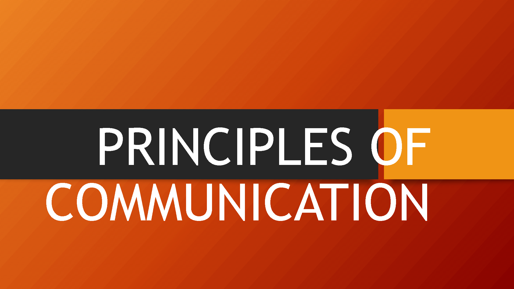

### Chapter at a glance:

_Here are detailed notes on **Professional Communication** suitable for a BTech 1st year course. These notes cover essential aspects of communication within a professional context, focusing on skills and practices that are vital in a technical or business environment._

### **1. Introduction to Communication**
**Communication** is the process of sharing or exchanging information, ideas, and feelings between individuals or groups. It can take various forms such as verbal, non-verbal, and written. Effective communication is key to building relationships and ensuring understanding.

### **2. Importance of Professional Communication**
In a professional setting, communication is crucial for:
- **Team Collaboration:** Helps in coordinating tasks, sharing information, and working toward common goals.
- **Problem-Solving:** Clear communication assists in identifying problems and finding solutions.
- **Leadership and Management:** Leaders use communication to guide, motivate, and organize teams.
- **Career Success:** Strong communication skills enhance your professional image, build networks, and help you move up in your career.
  
### **3. Characteristics of Professional Communication**
- **Clarity:** The message should be clear and easy to understand, avoiding ambiguity.
- **Conciseness:** Keep messages brief and to the point, while still conveying all necessary information.
- **Courtesy:** Politeness and respect are essential in professional communication.
- **Formality:** Professional communication often requires a formal tone, especially in written documents and official meetings.
- **Accuracy:** Facts and information shared must be precise to avoid misunderstandings.

### **4. Types of Professional Communication**

#### **a. Verbal Communication**
This includes spoken communication through direct conversation, presentations, phone calls, or video conferences.
- **Advantages:** Immediate feedback, personal connection, and easier to convey emotions.
- **Disadvantages:** Lack of permanent record, chance of misinterpretation due to unclear speech.

#### **b. Written Communication**
This form includes emails, reports, memos, letters, and official documents. Written communication is widely used in business for documentation and formal interactions.
- **Advantages:** Creates a permanent record, can be edited and revised before sending, used for formal or legal purposes.
- **Disadvantages:** Lacks immediacy, tone may be misunderstood without context.

#### **c. Non-verbal Communication**
This refers to communication without words, including body language, gestures, facial expressions, posture, and eye contact.
- **Importance in Professional Communication:** Non-verbal cues can enhance or contradict what is being said verbally. It's crucial to be aware of non-verbal signals in face-to-face interactions, especially in interviews, presentations, and meetings.

### **5. Principles of Effective Professional Communication**
- **Know Your Audience:** Tailor your message based on the needs, interests, and understanding of the people you're communicating with.
- **Active Listening:** Pay attention, ask clarifying questions, and show that you’re engaged in the conversation.
- **Feedback:** Encourage and provide feedback to ensure the message has been understood correctly.
- **Tone and Language:** Use an appropriate tone (formal, polite) and clear language suited to the professional environment.

### **6. Barriers to Communication**
- **Physical Barriers:** Distance or poor infrastructure (e.g., bad internet connection in virtual meetings).
- **Psychological Barriers:** Prejudices, emotions, or anxiety that affect understanding.
- **Language Barriers:** Differences in language or jargon that can create confusion.
- **Cultural Barriers:** Misunderstandings arising from cultural differences in communication styles or body language.

### **7. Listening Skills in Professional Communication**
**Active Listening** is a key skill in professional communication. It involves:
- Paying full attention to the speaker.
- Not interrupting.
- Summarizing or paraphrasing the speaker’s points to ensure understanding.
- Providing appropriate feedback.

### **8. Professional Written Communication**
**Emails, reports, and proposals** are common types of written communication in a professional setting. Here are some tips for effective written communication:
- **Structure:** Use a clear structure with an introduction, body, and conclusion.
- **Tone:** Keep it formal and polite. Avoid slang or overly casual language.
- **Proofread:** Always check for grammatical errors, spelling mistakes, and clarity before sending.
  
### **9. Technology and Communication**
In the digital age, technology plays a significant role in professional communication:
- **Email:** The most commonly used tool for professional communication. Emails should be formal, concise, and to the point.
- **Video Conferencing:** Tools like Zoom, Google Meet, and Microsoft Teams have become essential for virtual meetings and interviews.
- **Social Media and Networking:** LinkedIn and other platforms help professionals network, share ideas, and communicate with a wider audience.

### **10. Presentation Skills**
Presenting information clearly and engagingly is a crucial part of professional communication. Key aspects of good presentation skills include:
- **Preparation:** Know your material and the audience you're addressing.
- **Visual Aids:** Use slides, charts, or other visuals to support your points.
- **Confidence and Body Language:** Stand tall, maintain eye contact, and use appropriate gestures to emphasize points.
- **Clarity and Pacing:** Speak clearly and at a measured pace to ensure the audience can follow.

### **11. Ethics in Professional Communication**
Ethical communication is vital for maintaining integrity and professionalism in the workplace. This includes:
- **Honesty:** Always present information truthfully.
- **Confidentiality:** Respect privacy and do not share sensitive information without permission.
- **Respect:** Show respect to all individuals, regardless of their position or background.

### **12. Cross-Cultural Communication**
In global business environments, cross-cultural communication is crucial. Professionals must be aware of cultural differences in communication styles, gestures, and etiquette to avoid misunderstandings and build positive relationships.

### **13. Group Communication and Teamwork**
In professional settings, communication often happens within teams. Effective group communication involves:
- **Collaboration:** Sharing ideas and working together to achieve common goals.
- **Leadership:** A leader's ability to communicate clearly and motivate the team is essential for success.
- **Conflict Resolution:** Open communication can help resolve misunderstandings or conflicts that may arise within a team.

### **14. Conclusion**
**Professional communication** is a skill that is crucial for success in any career, especially in the technical and business fields. Mastering both verbal and written communication, understanding non-verbal cues, and adapting to new technological tools are essential to becoming an effective communicator. 

_These notes cover the foundational aspects of professional communication and should help you grasp the essential skills needed for your BTech course._

---

_Here are detailed notes on the topics mentioned in the academic syllabus related to **Professional Communication**, organized in the order mentioned in the syllabus provided:_

### **1. Importance of Communication**

Communication is essential in both personal and professional life as it:
- **Facilitates Understanding:** Clear communication ensures the accurate exchange of ideas, helping individuals understand each other better.
- **Builds Relationships:** Effective communication strengthens interpersonal and professional relationships.
- **Improves Decision-Making:** With accurate information and clarity, better decisions can be made.
- **Promotes Teamwork:** Helps in coordinating efforts, reducing misunderstandings, and enhancing collaboration.
- **Career Advancement:** Good communication skills help individuals stand out and achieve professional success.

### **2. Importance of Communication in English**

English is often regarded as the **global language of business**, and its importance in professional communication includes:
- **Global Reach:** English is widely used in international business, allowing for smoother communication across borders.
- **Professional Documentation:** Most formal documents, reports, and research papers are written in English.
- **Employment Opportunities:** Proficiency in English opens doors to better job prospects in multinational companies.
- **Collaboration:** Helps in collaborating with global teams, as it is the most common second language.

### **3. Concept of Effective Communication**

**Effective Communication** occurs when the message is clearly sent, received, and understood as intended. The key elements of effective communication include:
- **Clarity:** The message should be easy to understand.
- **Purpose:** The communication must have a specific goal or objective.
- **Feedback:** It’s important to get feedback to ensure the message is understood.
- **Adaptability:** Adapting the message according to the audience ensures better comprehension.
- **Listening:** Active listening ensures that the receiver understands the message properly.

### **4. Assertive Communication**

**Assertive Communication** is the ability to express one’s thoughts, opinions, and needs in a direct, honest, and respectful manner.
- **Characteristics of Assertive Communication:**
  - Confidence without being aggressive.
  - Clear and respectful expression of thoughts.
  - Maintaining eye contact and positive body language.
- **Benefits:**
  - Encourages open dialogue.
  - Prevents misunderstandings and conflicts.
  - Builds mutual respect in professional relationships.

### **5. Communication and Self-Concept**

**Self-concept** is an individual’s perception of themselves, which impacts how they communicate with others. It includes:
- **Self-awareness:** Understanding one’s strengths and weaknesses influences how confidently a person communicates.
- **Self-esteem:** Higher self-esteem usually results in more confident and effective communication.
- **Impact on Communication:** Positive self-concept leads to open and assertive communication, while negative self-concept can result in passive or defensive communication styles.

### **6. Role of Emotions in Communication**

Emotions significantly impact the way we communicate. The role of emotions in communication includes:
- **Influence on Tone:** Emotions can affect the tone and mood of communication (e.g., anger may lead to an aggressive tone).
- **Non-verbal Cues:** Emotions are often expressed through body language, facial expressions, and gestures.
- **Impact on Clarity:** Strong emotions like anxiety or frustration can cause miscommunication or lead to misunderstandings.
- **Emotional Intelligence:** Being aware of and managing emotions helps in maintaining professionalism and empathy during communication.

### **7. Process of Communication**

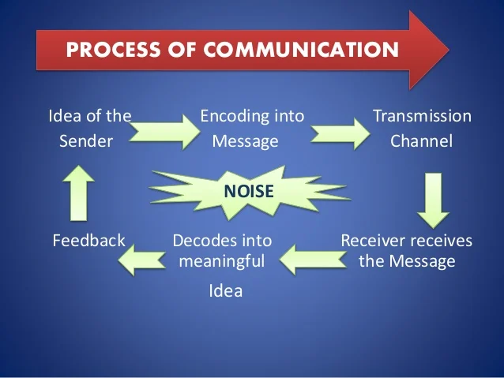

The **process of communication** involves several key steps:
1. **Sender:** The person who initiates the message.
2. **Encoding:** Converting the idea or information into a message.
3. **Message:** The content being communicated.
4. **Channel:** The medium (verbal, written, non-verbal) through which the message is sent.
5. **Receiver:** The person who receives the message.
6. **Decoding:** Interpreting and making sense of the message.
7. **Feedback:** The response from the receiver, indicating if the message was understood.

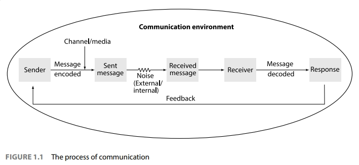

### **8. Knowing the Purpose and Audience**

Effective communication requires understanding:
- **Purpose:** Knowing the goal of the communication (e.g., informing, persuading, instructing) helps in structuring the message clearly.
- **Audience:** Tailoring communication based on the audience’s background, level of understanding, and expectations ensures relevance and effectiveness.

### **9. Types of Communication**

#### **a. Formal Communication**
- **Definition:** Official communication that follows a set structure or protocol within an organization.
- **Examples:** Emails, reports, memos, and meetings.
  
#### **b. Informal Communication**
- **Definition:** Casual, unofficial communication between colleagues or peers.
- **Examples:** Conversations during breaks, casual emails, or instant messages.

#### **c. Verbal Communication**
- **Definition:** Communication that uses spoken words.
- **Examples:** Meetings, presentations, phone calls.

#### **d. Non-verbal Communication**
- **Definition:** Communication through body language, facial expressions, gestures, and eye contact.
- **Importance:** Non-verbal cues can support or contradict what is being said verbally.

#### **e. Interpersonal Communication**
- **Definition:** Direct communication between two or more individuals.
- **Importance:** Key to building relationships and working collaboratively in teams.

#### **f. Intrapersonal Communication**
- **Definition:** Communication with oneself, including self-reflection and inner dialogue.
- **Importance:** Affects self-awareness and decision-making.

#### **g. Cross-Cultural Communication**
- **Definition:** Communication between people from different cultures or backgrounds.
- **Challenges:** Differences in language, non-verbal cues, and communication styles.
- **Importance:** Essential in global business to avoid misunderstandings and foster collaboration.

### **10. Organisational Communication**

**Organizational Communication** refers to the ways in which information flows within an organization.

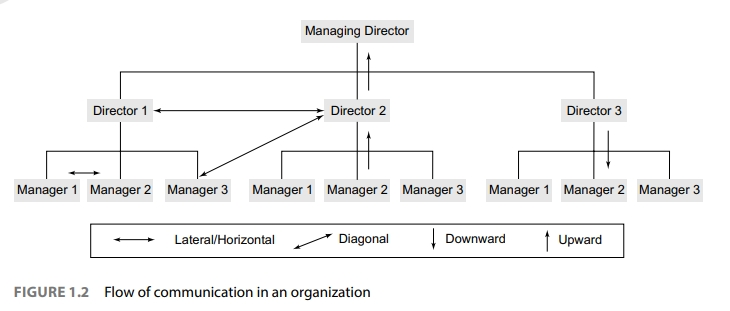

#### **a. Formal Channels of Communication**

1. **Upward Communication:**
   - Information flows from lower levels of the hierarchy to higher levels (e.g., employee to manager).
   - Importance: Helps management understand employee feedback and issues.
  
2. **Downward Communication:**
   - Information flows from higher levels to lower levels (e.g., manager to employee).
   - Importance: Ensures instructions, policies, and expectations are communicated clearly.

3. **Horizontal Communication:**
   - Communication between individuals or teams at the same level (e.g., peer-to-peer).
   - Importance: Promotes coordination and collaboration across departments.

4. **Diagonal Communication:**
   - Cross-departmental communication between individuals at different levels.
   - Importance: Encourages collaboration between different functions or divisions.

#### **b. Informal Channel of Communication: Grapevine**
- **Definition:** Unofficial, casual communication that occurs in organizations.
- **Characteristics:** Often based on rumors or informal conversations.
- **Advantages:** Can spread information quickly and encourage social bonding.
- **Disadvantages:** Information may be inaccurate or lead to misunderstandings.

### **11. Barriers to Communication**

**Barriers to communication** hinder the effective exchange of information. Some common barriers include:
- **Physical Barriers:** Poor infrastructure, distance, or noisy environments.
- **Psychological Barriers:** Emotions, stress, or preconceived notions that affect understanding.
- **Language Barriers:** Differences in language or jargon.
- **Cultural Barriers:** Differences in values, beliefs, or customs that affect interpretation.
- **Perceptual Barriers:** Differences in how individuals perceive and interpret information.

### **12. Tips for Effective Communication**

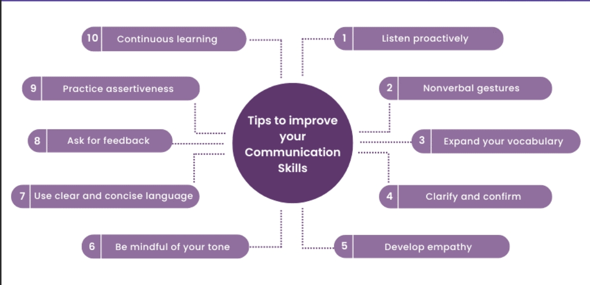

To communicate effectively, consider the following tips:
- **Be Clear and Concise:** Avoid unnecessary details and focus on the core message.
- **Active Listening:** Pay attention to the speaker, ask clarifying questions, and provide feedback.
- **Maintain Appropriate Body Language:** Use non-verbal cues that align with your message (e.g., eye contact, gestures).
- **Adapt to Your Audience:** Tailor your message based on the audience’s background and expectations.
- **Provide and Seek Feedback:** Encourage feedback to ensure the message is understood and to improve future communication.
- **Stay Open and Empathetic:** Be receptive to others' viewpoints and show understanding in your responses.

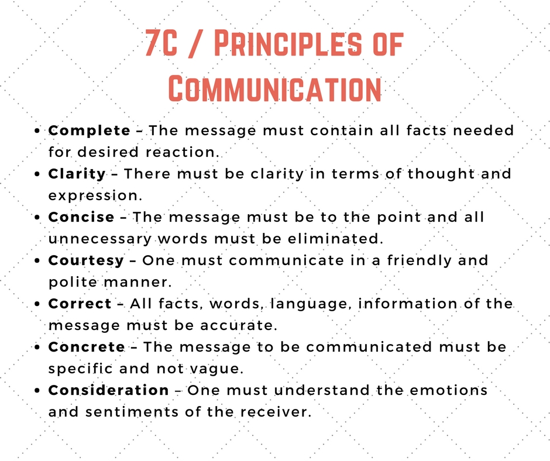

These notes comprehensively cover the topics related to **Professional Communication** for a BTech 1st year course. Let me know if you need further elaboration or clarification on any of these points!

---

# LISTENING SKILLS

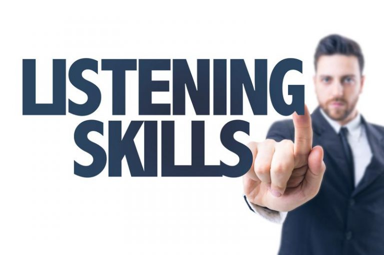

Here are both **brief** and **detailed** notes on the topics related to **Listening** in **Professional Communication** for BTech 1st year course:

### **1. Listening vs. Hearing**

#### Brief Notes:
- **Hearing**: Passive process of perceiving sound.
- **Listening**: Active process of understanding and interpreting sounds.

#### Detailed Notes:
- **Hearing** is the automatic, physiological act of perceiving sounds through the ear, which doesn’t necessarily involve comprehension.
- **Listening**, on the other hand, is a conscious effort where the listener pays attention, processes, and understands the speaker’s message.
- **Difference**: Hearing is involuntary and passive, while listening is active and requires engagement and effort.

### **2. Role of Effective Listening in Communication**

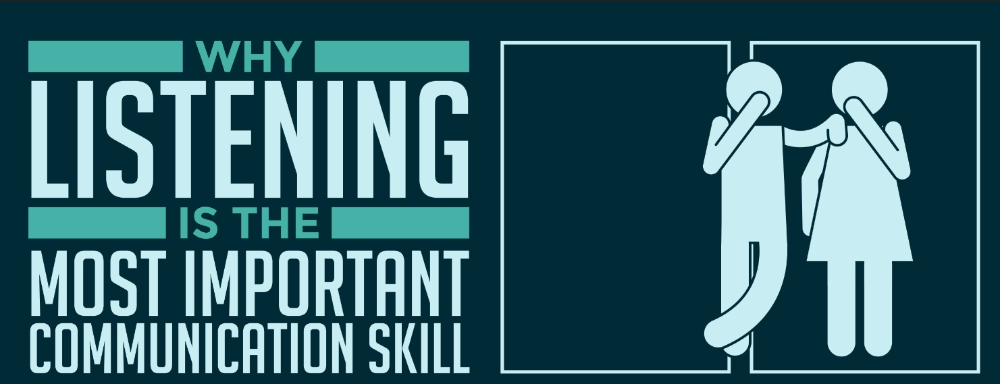

#### Brief Notes:
- Builds relationships, prevents misunderstandings, and enhances productivity in professional settings.

#### Detailed Notes:
- **Builds Trust and Rapport**: When you listen attentively, it shows respect and empathy, fostering stronger interpersonal relationships.
- **Prevents Misunderstandings**: Careful listening reduces the likelihood of miscommunication or errors, especially in professional environments.
- **Improves Decision-Making**: By understanding the full context of conversations, more informed and sound decisions can be made.
- **Increases Productivity**: Teams with effective listening skills work better together, ensuring that tasks are well-understood and completed efficiently.

### **3. Types of Listening**

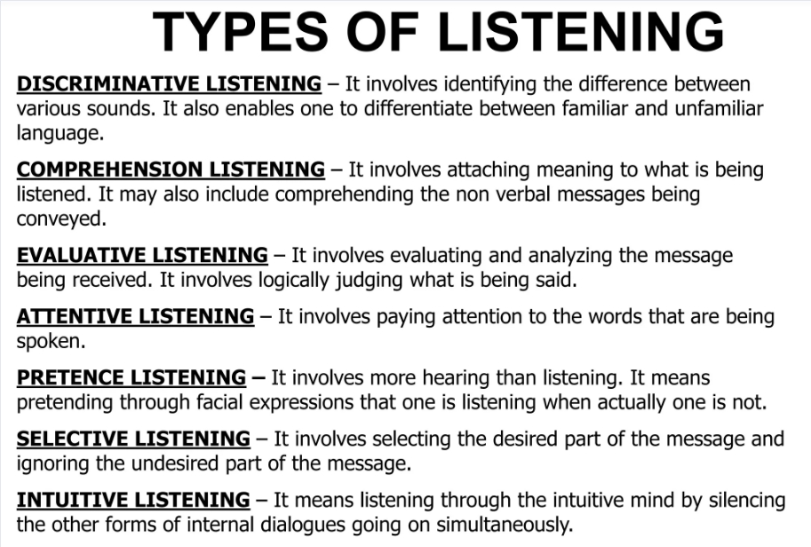

#### Brief Notes:
- **Active Listening**: Fully engaged and attentive.
- **Passive Listening**: Listening without response or feedback.
- **Critical Listening**: Evaluating and analyzing information.
- **Empathetic Listening**: Understanding the speaker’s emotions.
- **Comprehensive Listening**: Focused on understanding and retaining information.

#### Detailed Notes:
- **Active Listening**: Requires full attention, with feedback provided through verbal and non-verbal cues. Encourages deeper engagement and understanding.
- **Passive Listening**: Involves hearing the message without providing feedback or engagement. Common in situations where the listener is not required to respond.
- **Critical Listening**: Used when assessing or evaluating the content of the message. Important in situations requiring judgment or decision-making.
- **Empathetic Listening**: Focuses on understanding the emotions or feelings behind the speaker’s message. Builds trust and connection.
- **Comprehensive Listening**: Focuses on understanding the details and information in order to retain it for future use (e.g., in lectures or instructions).

### **4. Poor Listening Habits**

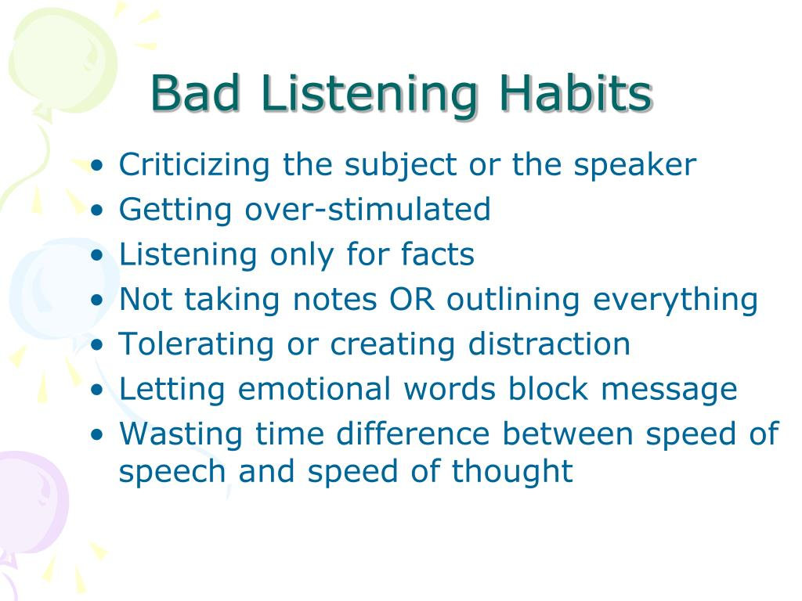

#### Brief Notes:
- Interrupting, selective listening, distractions, prejudging, and daydreaming.

#### Detailed Notes:
- **Interrupting**: Cutting off the speaker before they finish their thought, which can lead to incomplete understanding and frustration.
- **Selective Listening**: Only paying attention to parts of the conversation that interest the listener, leading to missed or incomplete information.
- **Distractions**: Letting external or internal factors (like noise or personal stress) interfere with paying attention to the message.
- **Prejudging**: Forming conclusions before the speaker has finished, which leads to misunderstanding and biased interpretation.
- **Daydreaming**: Letting the mind wander, resulting in missing key points of the conversation.

### **5. Active Listening – An Effective Listening Skill**

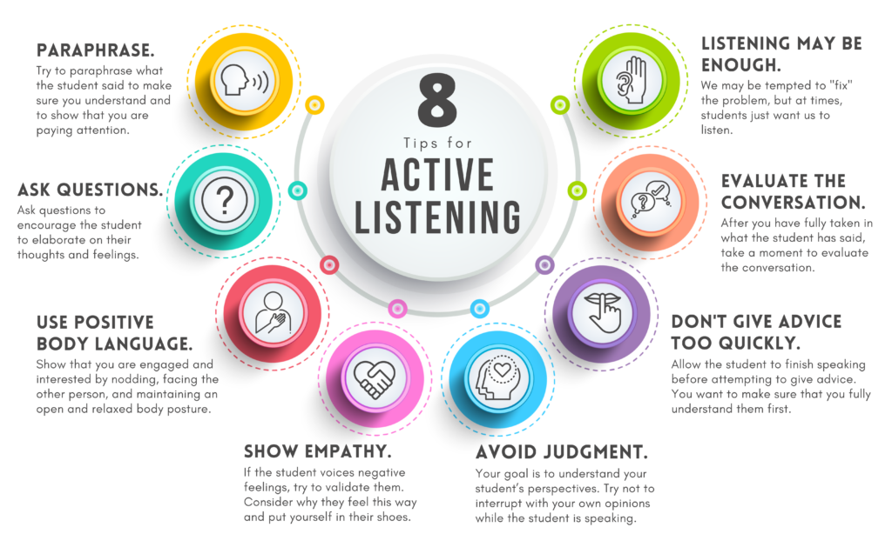

#### Brief Notes:
- Requires full engagement, providing feedback, and demonstrating attentiveness.

#### Detailed Notes:
- **Concentration**: Focus completely on the speaker, avoid distractions, and refrain from interrupting.
- **Feedback**: Provide responses, either through verbal affirmations like “I see” or non-verbal cues like nodding to show understanding.
- **Clarification**: Ask questions or paraphrase the speaker’s points to ensure clarity and confirm understanding.
- **Non-verbal Cues**: Maintain eye contact, show attentive body language, and use facial expressions that reflect interest and understanding.

### **6. Traits of an Effective Listener**

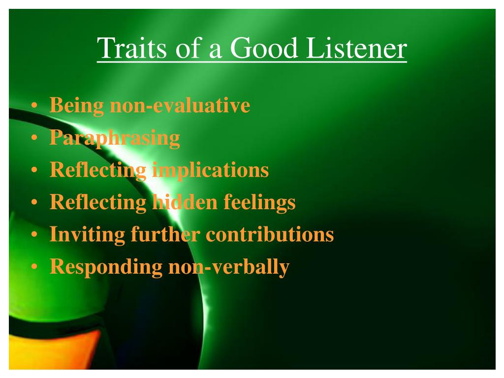

#### Brief Notes:
- Attentiveness, patience, empathy, open-mindedness, and clarity-seeking.

#### Detailed Notes:
- **Attentiveness**: Paying close attention to both verbal and non-verbal cues.
- **Patience**: Allowing the speaker to finish their thoughts without rushing or interrupting.
- **Empathy**: Understanding and connecting with the speaker’s emotions, showing genuine concern.
- **Open-mindedness**: Listening without bias or judgment, remaining open to new ideas or perspectives.
- **Clarity-Seeking**: Asking questions or seeking further explanation to ensure full comprehension of the message.

### **7. Barriers to Effective Listening**

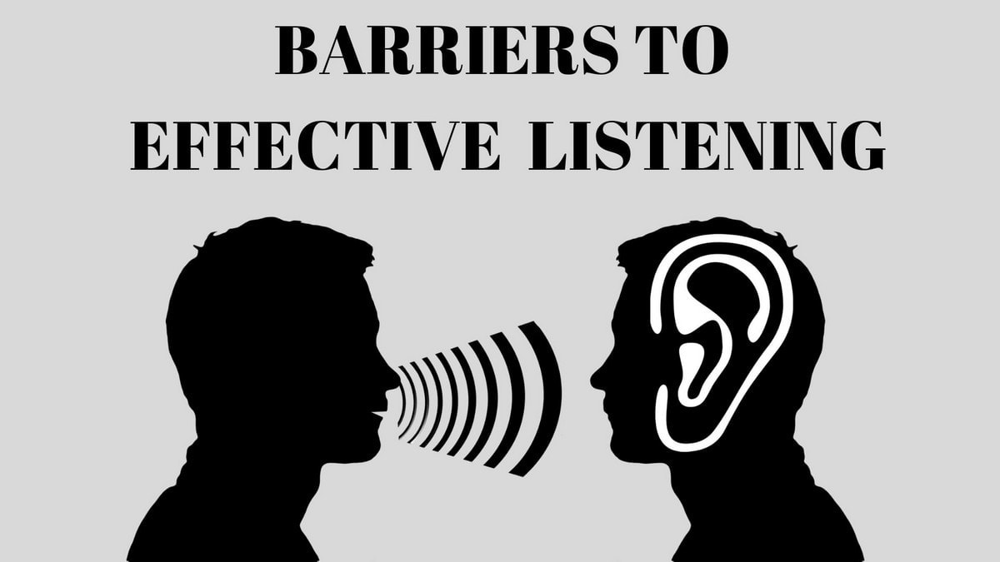

#### Brief Notes:
- Physical, psychological, emotional, and personal distractions; information overload; preconceived notions.

#### Detailed Notes:
- **Physical Barriers**: Environmental factors like noise, poor acoustics, or technical issues during communication.
- **Psychological Barriers**: Personal biases, assumptions, or prejudices that influence how a message is perceived.
- **Emotional Barriers**: Strong emotions such as stress, anger, or frustration that prevent clear understanding of the message.
- **Personal Distractions**: Internal distractions like fatigue, hunger, or preoccupation with personal issues.
- **Information Overload**: Receiving too much information at once can cause confusion and lead to selective attention.
- **Preconceived Notions**: Forming judgments or conclusions before fully listening to the message, leading to misunderstandings.

These notes should help you in your **Professional Communication** studies. Let me know if you need any more clarification!
