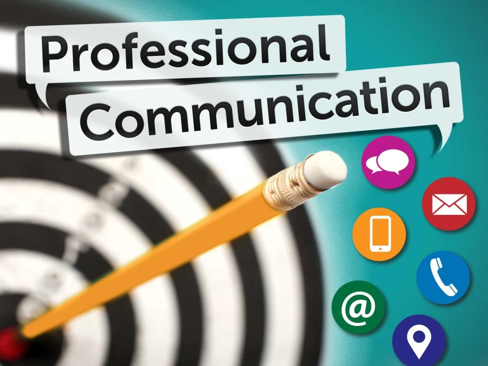

# PROFESSIONAL COMMUNICATION

## SYLLABUS

### Section - A

**UNIT 1. PRINCIPLES OF COMMUNICATION:** 

Importance of communication; Importance of communication in English; 
Concept of effective Communication; Assertive communication; 
Communication and self-concept; Role of emotions in communication; 
Process of communication; Knowing the purpose and audience. Types of 
Communication: formal and Informal Communication; verbal and non-verbal; interpersonal communication, intrapersonal communication; Cross 
cultural communication. Organisational Communication: Formal Channels of 
communication: upward communication, downward communication, 
horizontal communication and diagonal communication. Informal channel 
of communication: Grapevine. Barriers to Communication. Tips for effecƟve 
communication. 

| Content | Link |
|---------|------|
| Chapter at a Glance | [Principles of Communication](https://cg2024-gndec.github.io/communication/) |
| Other material | [Drive Folder](https://drive.google.com/drive/folders/1YlI9PHsUwZLbvxuPAEZxHZnTZ51-9Vje) |

**UNIT 2. LISTENING SKILLS:** 

Listening vs. Hearing; Role of Effective Listening in Communication; Types of 
Listening; Poor Listening Habits; Active Listening- an effective listening skill; 
Traits of an Effective Listener; Barriers to Effective Listening. 

| Content | Link |
|---------|------|
| Chapter at a Glance | [Listening Skills](https://cg2024-gndec.github.io/listening/) |
| Other material | [Drive Folder](https://drive.google.com/drive/folders/1YlI9PHsUwZLbvxuPAEZxHZnTZ51-9Vje) |

**UNIT 3. KINESICS & VOICE DYNAMICS:**
 
Kinesics: definition; importance. Features of body language: Personal 
appearance; Gestures; Postures; Facial expression; Eye contact; Silence; 
Voice modulation: Quality; Pitch. 

### Section-B

**UNIT 4. READING SKILLS:** 

Inferring meaning: lexical and contextual meaning. Reading Techniques; 
Intensive and Extensive reading skills. 

**UNIT 5. GRAMMAR AND BASIC WRITING SKILLS:** 

Sentence Structures; Subject-verb Concord; Misplaced Modifiers. Concept 
of Technical Writing; 7C’s of effective technical writing: Topic sentence; 
Creating unity and coherence. Argumentative essay; Writing an email; 
Business letter writing: Complaint letter, Collection Letter, Inquiry Letter; 
Preparing Cover letters and Resume. 

**UNIT 6. VOCABULARY SKILLS:** 

1. Idioms and phrases 
2. One-word substitutes 
3. Antonyms & Synonyms 
4. Homophone and homonym
5. Prefixes and Suffixes

---
